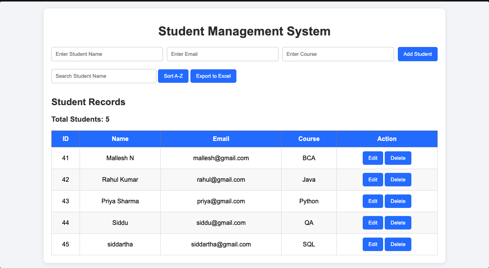
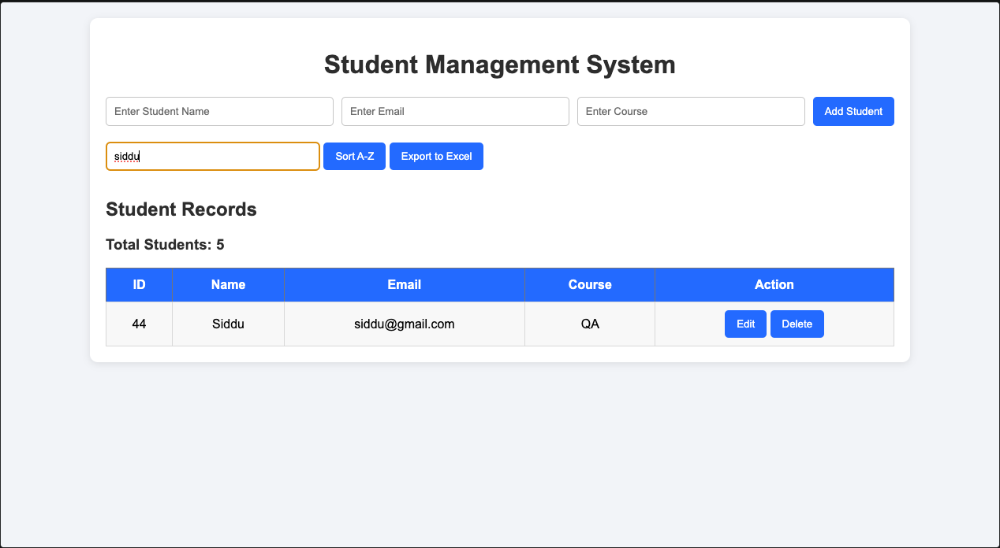
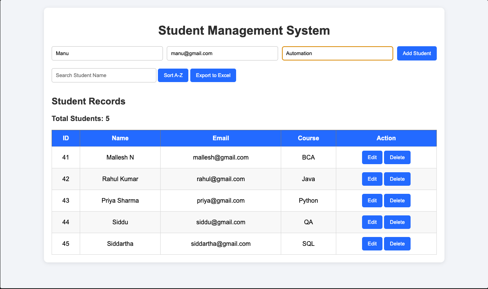
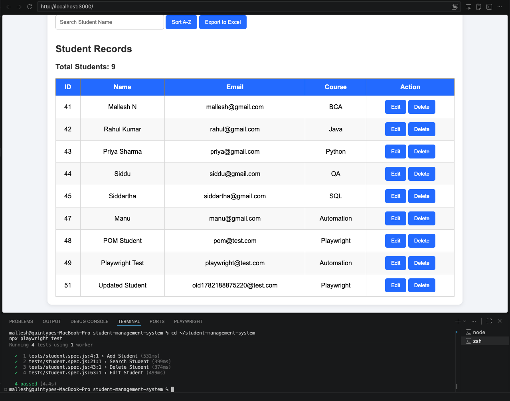

# Student Management System

A simple Student Management System built using HTML, CSS, JavaScript, Node.js, Express.js, MySQL, and Playwright Automation Testing.

## Features

* Add Student
* Search Student
* Edit Student
* Delete Student
* Sort Students A-Z
* Export Student Records to Excel
* Display Total Student Count
* Automated UI Testing using Playwright

## Tech Stack

* Frontend: HTML, CSS, JavaScript
* Backend: Node.js, Express.js
* Database: MySQL
* Testing: Playwright
* Version Control: Git & GitHub

## Project Screenshots

### Home Page

### Search Student

### Add Student

### Playwright Test Results

## Installation

1. Clone the repository

git clone https://github.com/malleshN63/student-management-system.git

2. Install dependencies

npm install

3. Configure MySQL database

Create database:

student_management

4. Start the application

node server.js

5. Open browser

http://localhost:3000

## Playwright Test Execution

Run all tests:

npx playwright test

View HTML report:

npx playwright show-report

## Author

Mallesh N
